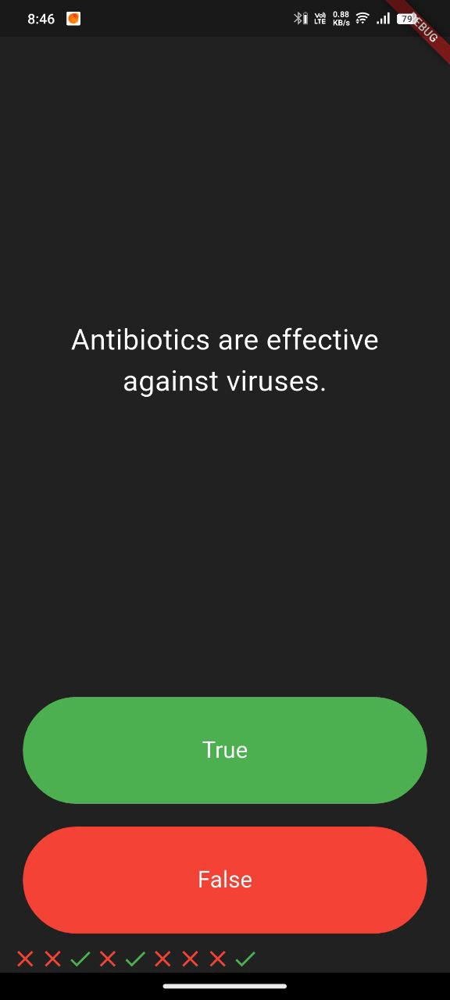

# 🧠 Quizyy

A new Flutter project.

---

## 📸 App Screenshot

### 📝 Quiz Page


> 📂 Place your screenshot image inside a `screenshots/` folder in the root directory.

---

## 🏁 Getting Started

This project is a starting point for a Flutter application.

A few resources to get you started if this is your first Flutter project:

- [Lab: Write your first Flutter app](https://docs.flutter.dev/get-started/codelab)
- [Cookbook: Useful Flutter samples](https://docs.flutter.dev/cookbook)

For help getting started with Flutter development, view the [online documentation](https://docs.flutter.dev/), which offers tutorials, samples, guidance on mobile development, and a full API reference.

---

## 🛠️ Installation

To set up and run this project locally:

1. **Clone the repository:**
   ```bash
   git clone https://github.com/your-username/quizyy.git
